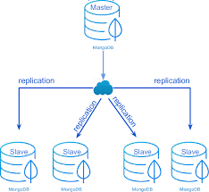
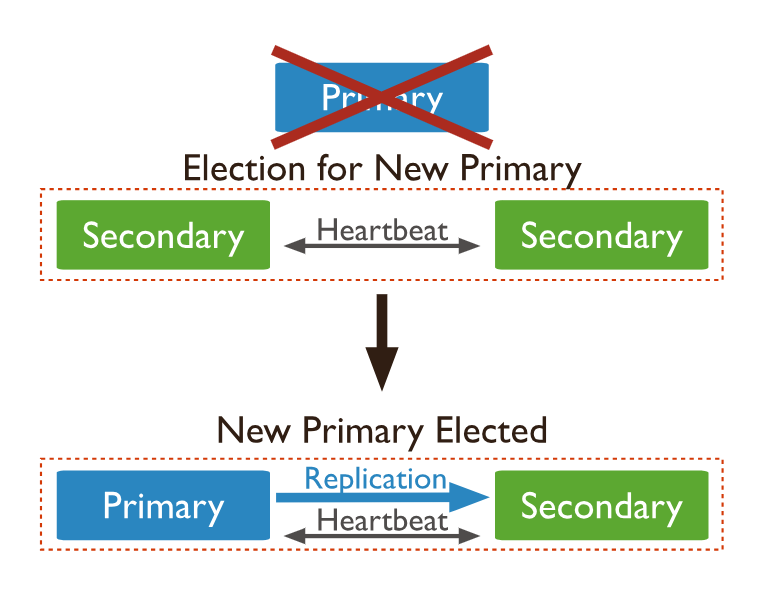
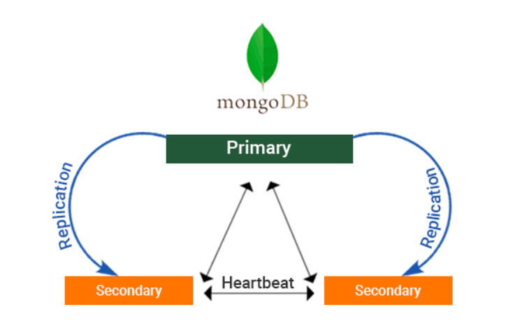
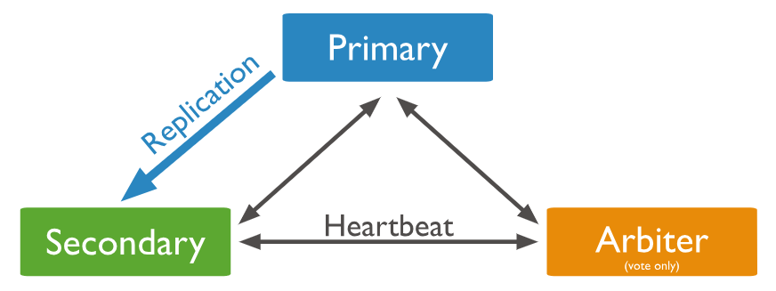

# Réplication dans MongoDB  

# 1. Comprendre le principe général de la réplication

La réplication consiste à maintenir **plusieurs copies cohérentes** d’une même base de données sur des serveurs différents, appelés *nœuds*.  
Elle constitue un pilier fondamental de la tolérance aux pannes dans les systèmes distribués.

<p align="center">
  
</p>


## 1.1 Pourquoi répliquer les données ?

Un système sans réplication rencontre trois problèmes majeurs :

| Problème | Conséquence |
|---------|-------------|
| Panne du serveur | Perte de service, indisponibilité totale |
| Surcharge | Ralentissement ou crash |
| Unicité du point de défaillance | Très faible robustesse |

La réplication permet au contraire :

- la **haute disponibilité** (service accessible même en cas de panne),  
- la **tolérance aux pannes**,  
- la **répartition de la charge**,  
- la **sécurité des données**.

---

## 1.2 Communication constante entre nœuds

Les nœuds répliqués échangent continuellement trois types d’informations :

### **a.** Les *heartbeats*
Messages courts envoyés toutes les quelques secondes pour dire :

> « Je suis en vie ».

Si un nœud arrête d’envoyer ces messages, il est déclaré *DOWN*.

### **b.** Les opérations de réplication
Chaque modification (INSERT, UPDATE, DELETE) effectuée sur le nœud principal est envoyée aux autres nœuds pour qu'ils restent synchronisés.

### **c.** L’état du cluster
Chaque nœud connaît :

- le retard de réplication,
- les nœuds actifs ou inactifs,
- son propre rôle (Primary, Secondary…).

---

## 1.3 Réplication synchrone vs asynchrone

###  Réplication synchrone
- L’écriture est confirmée *uniquement lorsque tous les nœuds ont répliqué la donnée*.
- Avantages : cohérence très forte.
- Inconvénients : très lent et peu scalable.

###  Réplication asynchrone *(cas de MongoDB)*
- Le Primary confirme l’écriture au client dès qu’elle est enregistrée localement.
- La réplication vers les Secondary a lieu ensuite.
- Avantages : rapide, scalable.
- Inconvénient : les Secondary peuvent être en retard.

---

## 1.4 Détection de panne et tolérance

Si un nœud cesse d’envoyer des heartbeats :

1. il est considéré comme inactif ;
2. les autres nœuds continuent à travailler ;
3. si c’est le Primary, une **élection automatique** est déclenchée.

Ce mécanisme permet au cluster de **s’auto-réparer**, sans intervention humaine.

---

# 2.  Application concrète dans une architecture maître–esclave

Le modèle maître–esclave (appelé **Primary–Secondary** dans MongoDB) est l’un des plus répandus.

---

## 2.1 Le rôle du maître (Primary)

Le Primary est le **seul nœud autorisé à recevoir les écritures**.

Il assure :

- l’ordre global des opérations,
- la cohérence des données,
- la propagation des modifications aux Secondary,
- la gestion du journal (oplog).

---

## 2.2 Le rôle des esclaves (Secondary)

Les Secondary :

- répliquent en continu les opérations du Primary,
- servent souvent pour des **lectures**, afin de décharger le Primary,
- peuvent devenir Primary en cas d’élection.

---

## 2.3 Pourquoi interdire les écritures sur les Secondary ?

Pour éviter les conflits d’écriture.

Exemple :  
Deux serveurs recevraient simultanément :

- Serveur A → `solde = solde + 50`  
- Serveur B → `solde = solde - 20`

Sans coordination → incohérence garantie.

D’où la règle :

> **Une seule source d’écriture → le Primary.**

---

## 2.4 Le processus d’élection en cas de panne

Lorsqu’un Primary tombe :

1. les Secondary détectent son absence (via heartbeat),
2. ils déclenchent une élection,
3. un Secondary devient le nouveau Primary.

Schéma :

<p align="center">
  
</p>


---

## 2.5 Le problème du partitionnement réseau (split-brain)

Un partitionnement divise chaque cluster :

<p align="center">
  
</p>

Le risque est d’obtenir deux Primary simultanés.

###  Solution : la règle de majorité

MongoDB ne permet l’élection d’un Primary que si le groupe possède **la majorité des votes**.

---

## 2.6 Le rôle de l’arbitre (Arbiter)

Un arbitre :

- ne stocke aucune donnée,
- ne participe pas à la réplication,
- participe uniquement **au vote**.

Il permet de conserver un nombre impair de votes.


<p align="center">
  
</p>

---

# 3.  Mise en place d’un Replica Set MongoDB

---

## 3.1 Création des répertoires

```
mkdir disque1
mkdir disque2
mkdir disque3
```

---

## 3.2 Lancement des serveurs MongoDB

```
mongod --replSet monreplicaset --port 27018 --dbpath disque1
mongod --replSet monreplicaset --port 27019 --dbpath disque2
mongod --replSet monreplicaset --port 27020 --dbpath disque3
```

---

## 3.3 Initialisation du Replica Set

```
mongo --port 27018
rs.initiate()
rs.add("localhost:27019")
rs.add("localhost:27020")
```

---

# 4.  Test de réplication

Sur le Primary :

```
use demo1
db.createCollection("person")
db.person.insert({ nom: "amani" })
db.person.insert({ nom: "chayma" })
db.person.insert({ nom: "dorra" })
```

Sur un Secondary :

```
rs.secondaryOk()
db.person.find()
```

---

# 5.  Simulation de panne du Primary

```
CTRL + C
```

Un Secondary devient automatiquement Primary.

---

# 6.  Ajout d’un arbitre

```
mkdir arbitre1
mongod --replSet monreplicaset --port 27021 --dbpath arbitre1
rs.addArb("localhost:27021")
```

---

#  Résultat final d’une architecture maître–esclave

 - Écritures sécurisées et ordonnées.

 - Lectures éventuellement réparties.

 - Cluster résilient :
      1. auto-élection,

      2. auto-réparation,

      3. protection contre la divergence des données.
