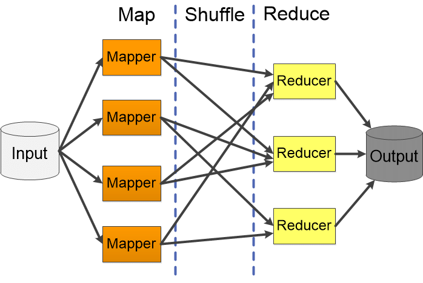
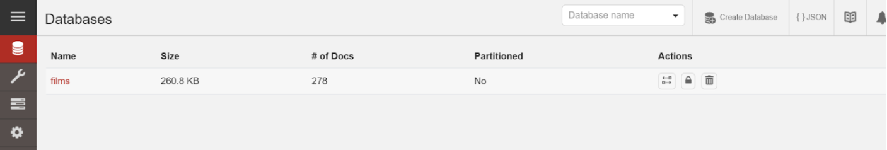
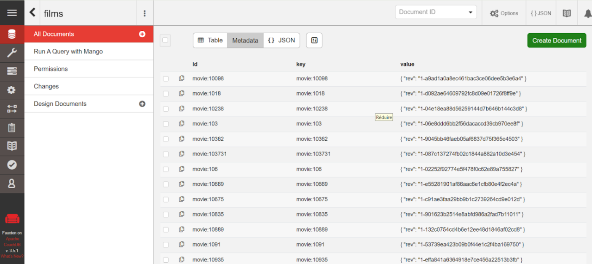
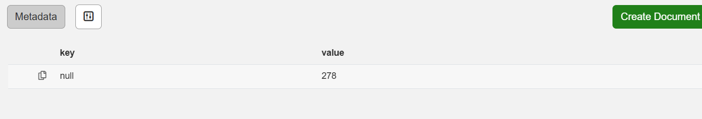
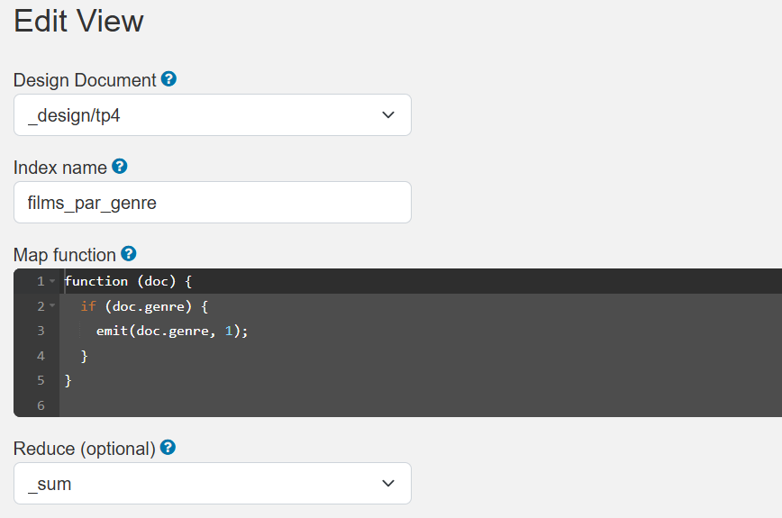
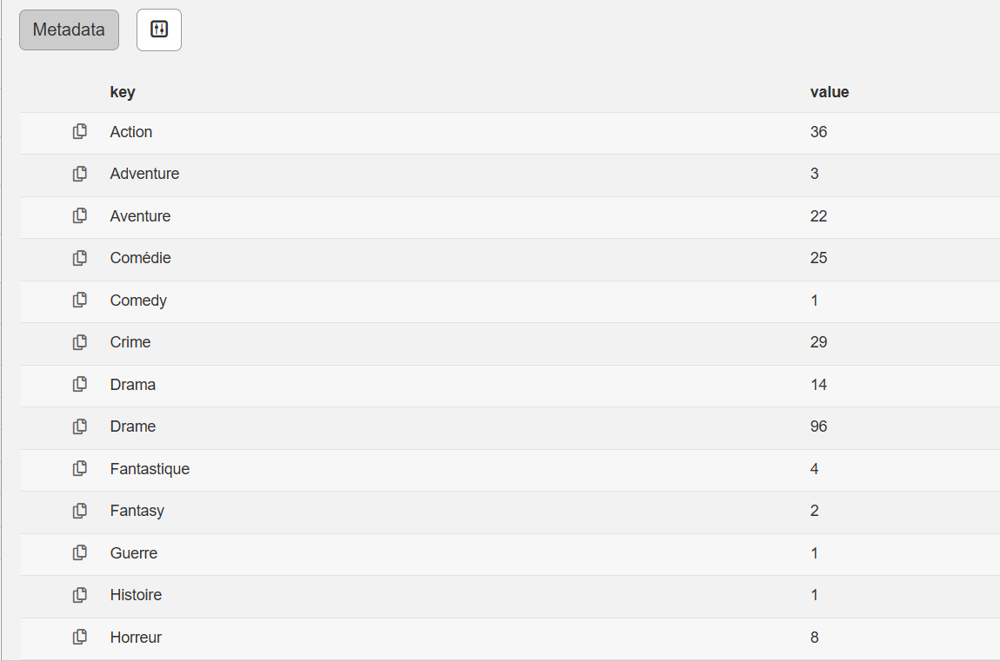
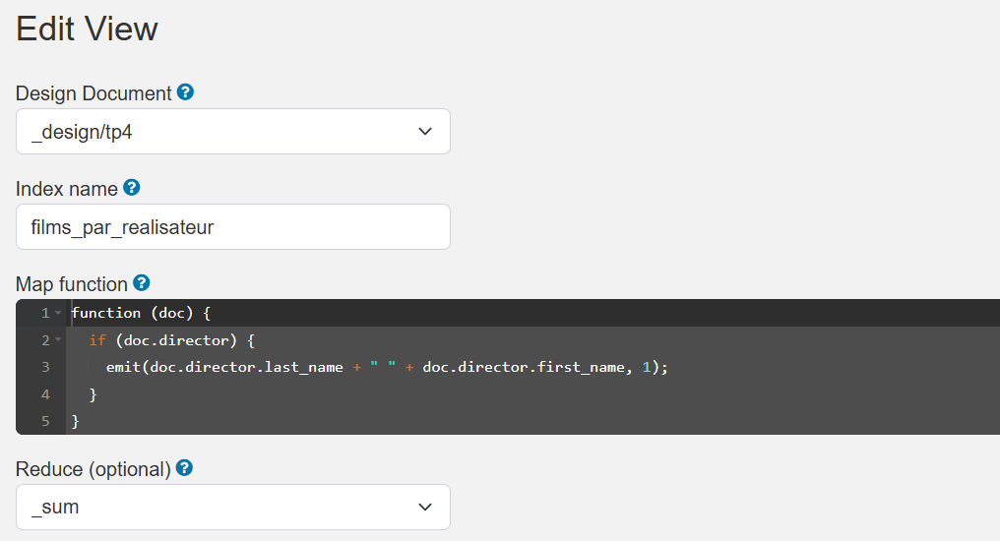
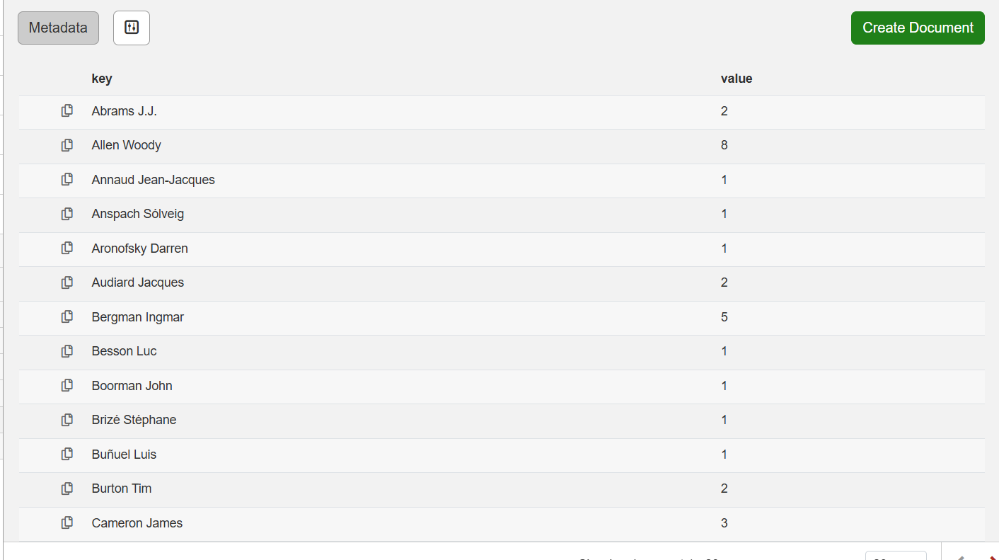

# TP n°4 — MapReduce avec CouchDB et MongoDB

---

## 1. Présentation générale 

### 1.1 Contexte

Les bases de données relationnelles classiques montrent leurs limites lorsqu’il s’agit de traiter de très grands volumes de données.
Dans ce contexte, le paradigme MapReduce, proposé initialement par Google, permet de traiter efficacement de grandes quantités de données.

MapReduce permet :
- le traitement de grands volumes de données,
- la parallélisation des calculs,
- la simplification des traitements distribués.

---

### 1.2 Principe du modèle MapReduce

Le modèle MapReduce repose sur deux fonctions principales :

- **Map** : transforme chaque document en paires clé–valeur.
- **Reduce** : agrège les valeurs associées à une même clé.

Une phase intermédiaire de regroupement (*shuffle*) est réalisée automatiquement comme illustré dans l'image ci-dessous.

<p align="center" >
  
</p>

---

## 2. Prise en main de CouchDB

### 2.1 Présentation de CouchDB

CouchDB est une base de données NoSQL orientée documents développée par la fondation Apache.
Les données sont stockées sous forme de documents JSON et accessibles via une API REST.
CouchDB intègre nativement un moteur MapReduce et une interface graphique nommée Fauxton.

---

### 2.2 Installation avec Docker

La prise en main de CouchDB a été réalisée à l’aide de Docker afin de simplifier l’installation.

```bash
docker run -d --name couchdb \
  -e COUCHDB_USER=admin \
  -e COUCHDB_PASSWORD=admin \
  -p 5984:5984 \
  couchdb:latest
```
Une fois le conteneur lancé, l’interface Fauxton est accessible à l’adresse :
```
http://localhost:5984/_utils
```
---
<p align="center" >
  
</p>

<p align="center" >
  
</p>


## 3. Aux origines du MapReduce — Application avec CouchDB

### 3.1 Modélisation de la matrice M

Chaque ligne de la matrice M est représentée par un document JSON.

```json
{
  "_id": "page_Pi",
  "page": "Pi",
  "links": [
    { "to": "Pj", "weight": 0.4 },
    { "to": "Pk", "weight": 0.6 }
  ]
}
```

---

### 3.2 Calcul de la norme des vecteurs

```js
function (doc) {
  doc.links.forEach(function (link) {
    emit(doc.page, link.weight * link.weight);
  });
}
```

```js
function (key, values) {
  return sum(values);
}
```

---

### 3.3 Produit matrice–vecteur

```js
var W = {
  "P1": w1,
  "P2": w2,
  "P3": w3
};

function (doc) {
  doc.links.forEach(function (link) {
    emit(doc.page, link.weight * W[link.to]);
  });
}

function (key, values) {
  return sum(values);
}
```

---

## 4. MapReduce avec MongoDB et CouchDB

Les questions 1 à 5 ont été traitées avec CouchDB.
Les questions 6 à 16 ont été traitées avec MongoDB.

---

## Questions 1 à 5 — CouchDB

### 1. Compter le nombre total de films dans la collection.

```js
function (doc) {
  emit(null, 1);
}
```
Reduce : `_sum`

<p align="center" >
  
</p>
résultat:
<p align="center" >
  
</p>
---

### 2. Compter le nombre de films par genre.

```js
function (doc) {
  if (doc.genre) emit(doc.genre, 1);
}
```
Reduce : `_sum`
<p align="center" >
  
</p>
Résultat:
<p align="center" >
  
</p>

---

### 3. Compter le nombre de films réalisés par chaque réalisateur.

```js
function (doc) {
  if (doc.director) {
    emit(doc.director.last_name + " " + doc.director.first_name, 1);
  }
}
```
Reduce : `_sum`
<p align="center" >
  
</p>
Résultat:
<p align="center" >
  
</p>

---

### 4. Compter le nombre d’acteurs uniques apparaissant dans tous les films.

```js
function (doc) {
  if (doc.actors) {
    doc.actors.forEach(a =>
      emit(a.last_name + " " + a.first_name, 1)
    );
  }
}
```
Reduce : `_sum`

---

### 5. Lister le nombre de films par année de sortie.

```js
function (doc) {
  if (doc.year) emit(doc.year, 1);
}
```
Reduce : `_sum`

---

## Questions 6 à 16 — MongoDB

### 6. Calculer la note moyenne par film à partir du tableau grades 

```js
db.films.mapReduce(
  function () {
    if (this.grades)
      this.grades.forEach(g =>
        emit(this.title, { sum: g.score, count: 1 })
      );
  },
  function (key, values) {
    return values.reduce((r, v) => {
      r.sum += v.sum;
      r.count += v.count;
      return r;
    }, { sum: 0, count: 0 });
  },
  {
    out: "avg_by_film",
    finalize: (k, v) => v.sum / v.count
  }
);
```

---

### 7. Calculer la note moyenne par genre.

```js
db.films.mapReduce(
  function () {
    if (this.genre && this.grades)
      this.grades.forEach(g =>
        emit(this.genre, { sum: g.score, count: 1 })
      );
  },
  function (key, values) {
    return values.reduce((r, v) => {
      r.sum += v.sum;
      r.count += v.count;
      return r;
    }, { sum: 0, count: 0 });
  },
  {
    out: "avg_by_genre",
    finalize: (k, v) => v.sum / v.count
  }
);
```

---

### 8. Calculer la note moyenne par réalisateur.


```js
db.films.mapReduce(
  function () {
    if (this.director && this.grades)
      this.grades.forEach(g =>
        emit(this.director, { sum: g.score, count: 1 })
      );
  },
  function (key, values) {
    return values.reduce((r, v) => {
      r.sum += v.sum;
      r.count += v.count;
      return r;
    }, { sum: 0, count: 0 });
  },
  {
    out: "avg_by_director",
    finalize: (k, v) => v.sum / v.count
  }
);
```

---

### 9. Trouver le film avec la note maximale la plus élevée

```js
db.films.mapReduce(
  function () {
    if (this.grades)
      this.grades.forEach(g =>
        emit("max", { title: this.title, score: g.score })
      );
  },
  function (key, values) {
    return values.reduce((a, b) => a.score > b.score ? a : b);
  },
  { out: "best_film" }
);
```

---

### 10. Compter le nombre de notes supérieures à 70 dans tous les films.

```js
db.films.mapReduce(
  function () {
    if (this.grades)
      this.grades.forEach(g => {
        if (g.score > 70) emit("count", 1);
      });
  },
  function (key, values) {
    return Array.sum(values);
  },
  { out: "scores_above_70" }
);
```

---

### 11. Lister tous les acteurs par genre, sans doublons.


```js
db.films.mapReduce(
  function () {
    if (this.genre && this.actors) {
      this.actors.forEach(a => emit(this.genre, a));
    }
  },
  function (key, values) {
    return Array.from(new Set(values));
  },
  { out: "actors_by_genre" }
);
```

---

### 12. Trouver les acteurs apparaissant dans le plus grand nombre de films.

```js
db.films.mapReduce(
  function () {
    if (this.actors) {
      this.actors.forEach(a => emit(a, 1));
    }
  },
  function (key, values) {
    return Array.sum(values);
  },
  { out: "films_by_actor" }
);
```

---

### 13. Classer les films par lettre de grade majoritaire ( A , B , C , etc.)

```js
db.films.mapReduce(
  function () {
    if (!this.grades) return;
    let freq = {};
    this.grades.forEach(g => freq[g.grade] = (freq[g.grade] || 0) + 1);
    let major = Object.keys(freq).reduce((a, b) => freq[a] > freq[b] ? a : b);
    emit(this.title, major);
  },
  function (key, values) {
    return values[0];
  },
  { out: "major_grade_by_film" }
);
```

---

### 14. Note moyenne par année

```js
db.films.mapReduce(
  function () {
    if (this.year && this.grades)
      this.grades.forEach(g =>
        emit(this.year, { sum: g.score, count: 1 })
      );
  },
  function (key, values) {
    return values.reduce((r, v) => {
      r.sum += v.sum;
      r.count += v.count;
      return r;
    }, { sum: 0, count: 0 });
  },
  {
    out: "avg_by_year",
    finalize: (k, v) => v.sum / v.count
  }
);
```

---

### 16. Réalisateurs avec moyenne > 80
À partir du résultat de la question 8 :
```js
db.avg_by_director.find({ value: { $gt: 80 } });
```

---
